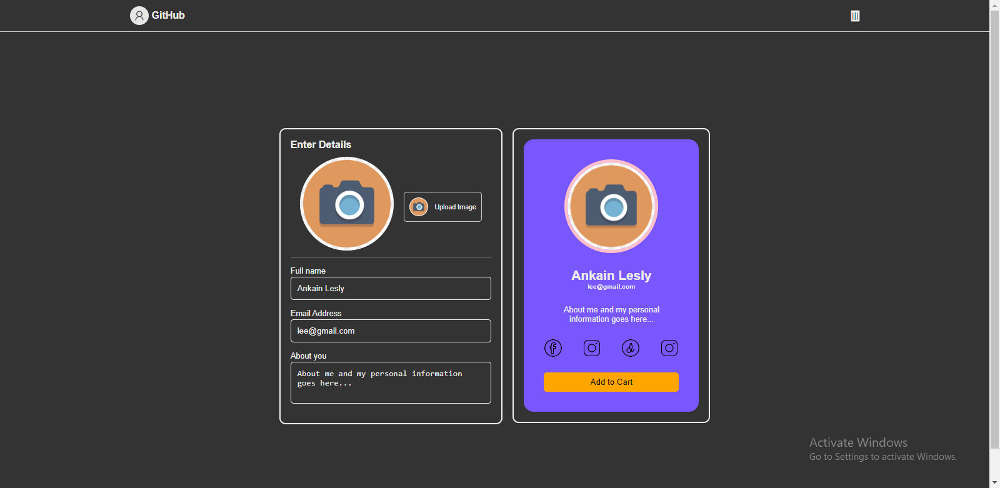

# UI Templating with JavaScript

Templating a design interface with data driven from an HTML Form using JavaScript. With Hot Reload on every input

This project basically listens to special inputs on keypress in our DOM, gets its value and display a formated result on an interface.

## Screenshots

